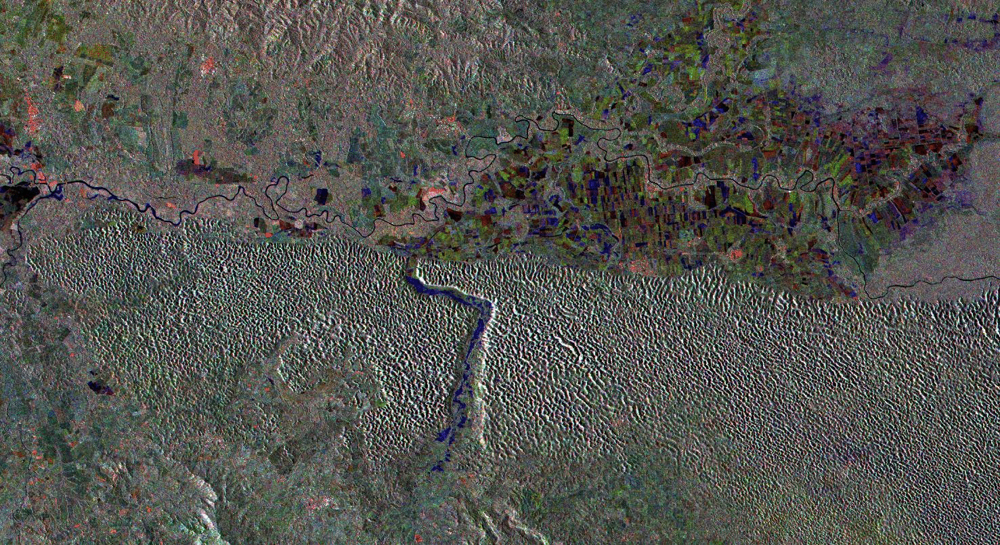

```{r setup, include=FALSE}
knitr::opts_chunk$set(echo = TRUE)
```

## Generate virtual raster

```{bash, eval = F}
gdalbuildvrt -separate geom_corrected/stack.vrt \
  geom_corrected/S1A_IW_GRDH_1SDV_20200719_20200731_Stack_Spk_Orb_TC.data/*.img
```

## Create training sites in QGIS using the multiband visualization layer (flooded-blue)


##Run the classification algorithm

```{r, warning=F, message=F}
library(rgdal)
library(gdalUtils)
library(raster)
library(caret)
library(randomForest)
```


```{r, eval=F}
#PREPARANDO DATOS PARA CLASIFICACION
img <- brick('geom_corrected/stack.vrt')
names(img) <- c('VH_20200719_T2245UTC','VH_20200731_T2245UTC','VV_20200719_T2245UTC','VV_20200731_T2245UTC')
img
#TRSITES
trdata <- readOGR('trsites/trsites.geojson', stringsAsFactors=T)
columnaresp <- 'tipo'
#TABLA ENTRENAMIENTO
dftodo <- data.frame(matrix(vector(), nrow = 0, ncol = length(names(img)) + 1))
categorias <- NULL; i <- NULL; mapacategorias <- NULL; datos <- NULL; df <- NULL
for (i in 1:length(unique(trdata[[columnaresp]])))
{
  categorias <- unique(trdata[[columnaresp]])[i]
  mapacategorias <- trdata[trdata[[columnaresp]] == categorias,]
  datos <- extract(img,mapacategorias)
  datos <- lapply(datos, function(x){cbind(x, clase = as.numeric(rep(categorias, nrow(x))))})
  df <- do.call("rbind", datos)
  dftodo <- rbind(dftodo, df)
}
dftodo$clase <- as.factor(dftodo$clase)
str(dftodo)
#head(dftodo)
muestras <- 10000
sdftodo <- subset(dftodo[sample(1:nrow(dftodo), muestras), ])
#head(sdftodo)
#str(sdftodo)
#sdftodo <- sdftodo[,c(2:4,7)]
modelorf <- train(clase ~ VH_20200719_T2245UTC + VH_20200731_T2245UTC + VV_20200719_T2245UTC + VV_20200731_T2245UTC, method = "rf", sdftodo)
modelorf
#PREDICCION SOBRE IMAGEN Y SUAVIZADO CON FILTRO MODAL VENTANA 3X3
lclasifrf <- raster::predict(img, modelorf)
writeRaster(lclasifrf, 'classified/lclasifrf.tif', drivername = 'GTiff')
mf <- matrix(rep(1,25), nrow=5)
mf
lclasifrffm <- focal(lclasifrf, mf, modal)
writeRaster(lclasifrffm, 'classifiedlclasifrffm.tif', drivername='GTiff')
```

## Post-processing

- Created a GRASS region
- Imported the raster `lclasifrf.tif` into it
- Converted the raster to vector (file: `classified.gpkg`)

```{r}
flooded <- readOGR('classified.gpkg')
plot(flooded)
```

EN: Tropical storm Isaias: flooded areas, Northeast Dominican Republic, as of 31 de julio, 2020, 6 pm local time
SP: Tormenta tropical Isaias: zonas inundadas, Nordeste República Dominicana, al 31 de julio de 2020, 6 pm hora local


